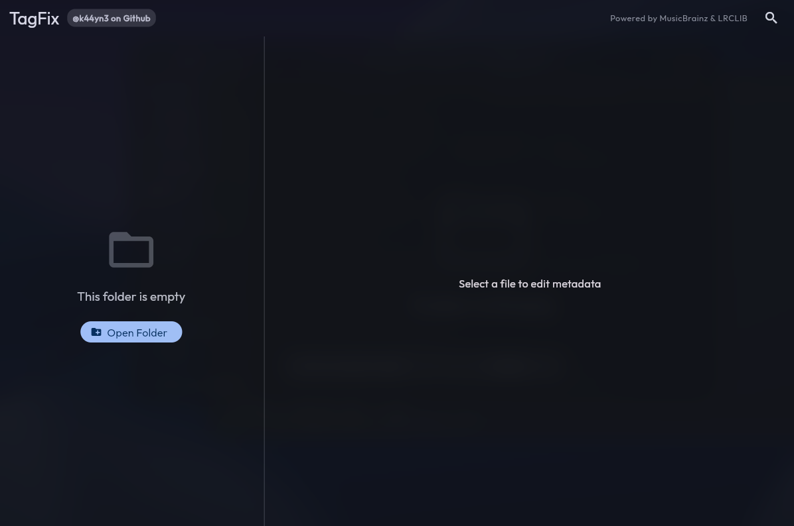
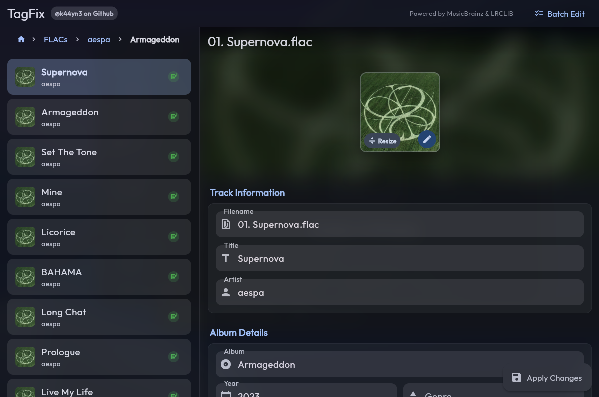
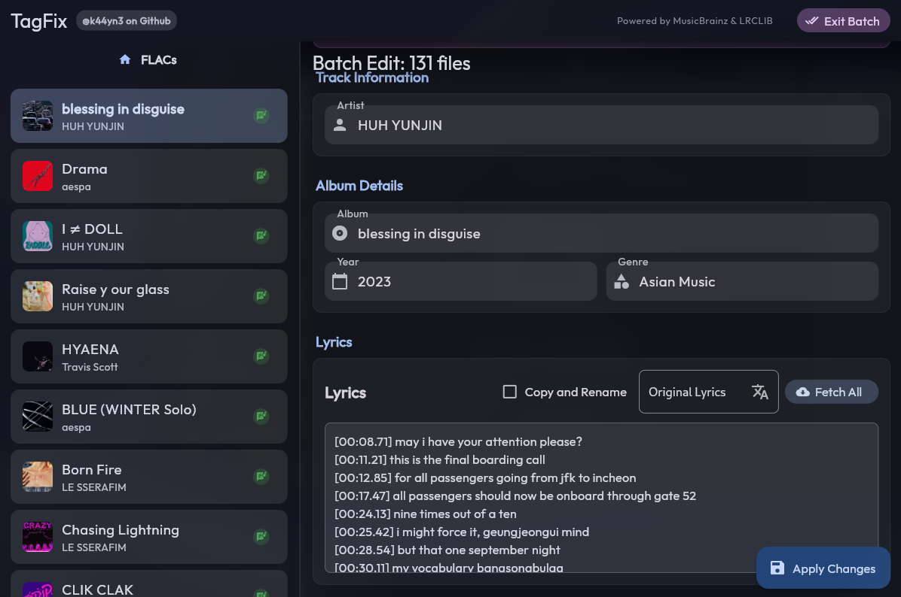

# TagFix

[](https://opensource.org/licenses/MIT)
[](https://github.com/k44yn3/tagfix)
[](https://github.com/k44yn3/tagfix)


A powerful audio metadata editor supporting FLAC, MP3, M4A, OGG, OPUS, WMA, and WAV formats.

**[Android Release](https://github.com/k44yn3/tagfixandroid)** | **[Desktop Releases](https://github.com/k44yn3/tagfix/releases)** (Windows/Linux)

## Features

- **Batch Editing**: Support batch editing relevant metadata, album covers and lyrics 
- **Metadata**: Edit Title, Artist, Album, Year, Genre, Track/Disc.
- **Cover Art**: Update album covers (Local/Online).
- **Lyrics**: Embed lyrics (Local/Online).
- **Conversion**: Convert to WAV or FLAC.
- **Scanning**: Recursive directory processing.

## Screenshots










## Building

### Flutter Desktop

**Prerequisites**
- Flutter SDK
- **Linux**: `clang cmake ninja-build pkg-config libgtk-3-dev liblzma-dev`
- **Windows**: Visual Studio 2022 with C++ workload

```bash
cd flutter_app
flutter pub get
flutter build linux --release   # Linux
flutter build windows --release # Windows
```

### CLI Version

**Prerequisites**: Python 3.8+, FFmpeg

```bash
pip install -r requirements.txt
python3 tagfix.py
```

## Credits

- [Flutter](https://flutter.dev/)
- [FFmpeg](https://www.ffmpeg.org/)
- [MusicBrainz](https://musicbrainz.org/)
- [Lrclib](https://lrclib.net/)
- [LRCGET](https://github.com/tranxuanthang/lrcget)
